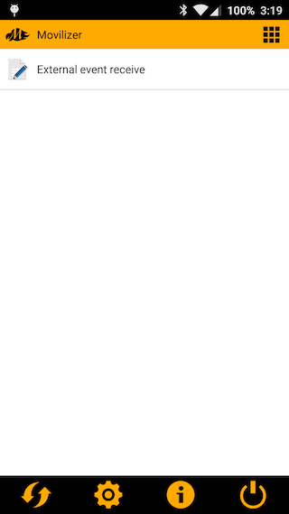
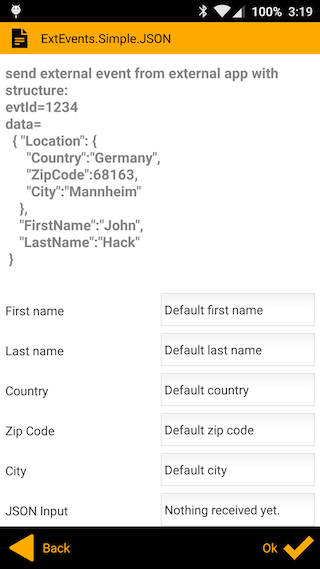

#  Movilizer External Events Demo application

## Concept

This is a demo application that triggers external events to Movilizer Android application. This application code can be reused, when writing application that need integraiton with Movilizer Client. The overall idea is that within Movilizer Movelet, a MEL code can be registered to listen to external events, and when event occurs, can parse and process the input data. Within the Movilizer Android Client, the conneciton is made using intents.

## Requirements

You need a working account within Movilizer Demo or Productive Cloud. You will need to know your 
- System ID - for cloud backend request
- System password - for cloud backend request
- Participant Device ID - for client login
- Participant's password - for client login

Development envirounment:
- Java 1.7+
- Android Studio with Android SDK installed (the demo application is designed for API16+)

## Installation

-  On developer machine
  1. Open the DEMO project using Android Studio
  2. Launch the DEMO Project

-  On Android device
  1. Download Movilizer Client from Google Play store
  2. Start Movilizer Client and register in Demo system using your credentials
  3. Execute the following backend request, in order to create the test movelet that will receive external events

```xml
<MovilizerRequest requestTrackingKey="" systemId="YOUR_SYSTEM_ID" systemPassword="YOUR_SYSTEM_PASSWORD" 
	numResponses="1000" synchronousResponse="true" 
	useAutoAcknowledge="true" xmlns="http://movilitas.com/movilizer/v14">
	<moveletDelete moveletKey="external_event_1" moveletKeyExtension="${#Project#participantKey}" />
	<moveletSet>
		<movelet moveletKey="external_event_1" moveletKeyExtension="${#Project#participantKey}" 
				moveletType="MULTI" initialQuestionKey="Q3">
			<question key="Q3" title="ExtEvents.Simple.JSON" type="5">
	            <answer key="Q3A0" position="0" nextQuestionKey="END">
	                <text>First name</text>
	                <predefinedValue>Default first name</predefinedValue>
	            </answer>
	            <answer key="Q3A1" position="1" nextQuestionKey="END">
	                <text>Last name</text>
	                <predefinedValue>Default last name</predefinedValue>
	            </answer>
	            <answer key="Q3A2" position="2" nextQuestionKey="END">
	                <text>Country</text>
	                <predefinedValue>Default country</predefinedValue>
	            </answer>
	            <answer key="Q3A3" position="3" nextQuestionKey="END">
	                <text>Zip Code</text>
	                <predefinedValue>Default zip code</predefinedValue>
	            </answer>
	            <answer key="Q3A4" position="4" nextQuestionKey="END">
	                <text>City</text>
	                <predefinedValue>Default city</predefinedValue>
	            </answer>
	            <answer key="Q3A5" position="5" nextQuestionKey="END">
	                <text>JSON Input</text>
	                <predefinedValue>Nothing received yet.</predefinedValue>
	            </answer>
	            <text>send external event from external app with structure: 
evtId=1234 
data=
  { "Location": { 
      "Country":"Germany",
      "ZipCode":68163, 
      "City":"Mannheim"
    },
    "FirstName":"John",
    "LastName":"Hack"
 } 
	            </text>
	            <onEnterAssignment>
	                subscribeExternalEventId(1234);
	            </onEnterAssignment>
	            <onExternalEvent>
	                function($ref:evtSrc, $ref:data)
	                {
	                	setAnswerValue($answer:"Q3A0", data["FirstName"]);
	                    setAnswerValue($answer:"Q3A1", data["LastName"]);
	                    setAnswerValue($answer:"Q3A2", data["Location"]["Country"]);
	                    setAnswerValue($answer:"Q3A3", data["Location"]["ZipCode"]);
	                    setAnswerValue($answer:"Q3A4", data["Location"]["City"]);
	                    setAnswerValue($answer:"Q3A5", printArray(data, '{', ':', ',', '}'));
	                }
	            </onExternalEvent>
	            
	        </question>
			<name>External event receive</name>
		</movelet>
		<participant participantKey="YOUR_PARTICIPANT_KEY" name="YOUR_PARTICIPANT_NAME" deviceAddress="YOUR_PARTICIPANTS_DEVICE_ADDRESS"></participant>
	</moveletSet>
</MovilizerRequest>
``` 

The data that is passed from the demo app to Movilizer Client is formatted in a JSON string:
```js
{ 
	"Location": { 
		"Country":"Germany",
		"ZipCode":68163, 
      	"City":"Mannheim"
    },
    "FirstName":"John",
    "LastName":"Hack"
 }
```

## Testing external events

- Open registered Movilizer Client on Android device

 

If you have sent the request to the cloud and registered successfuly on the client - you should have "External event receive" movelet in your main menu

- Open the movelet, that has a subscription and processing MEL code:

 

You should notice that the screen has some default values, that on external event will be populated with the data sent from DEMO app.

- Open the DEMO application and hit the "Send" button.

 

At this step you should receive in the description area return code 1 - this means a successfuly sent and received event

- Open Movilizer Client and check the data:

 

## Code walk-through

The overall logic is demonstrated in the class [com.movilizer.eedemo.MainActivity](app/src/main/java/com/movilizer/eedemo/MainActivity.java) 
The method that holds the overall logic for sending the external event is `private void doSendMessage()` and is triggered upon click on the "Send" button.

First you need to create a service connection object, to register reply message handler and to create the real message object:
```java
this.connection = new RemoteServiceConnection();
this.replyTo = new Messenger(new IncomingHandler());

message = Message.obtain();
```

then you need to register the service intent. Here in the example, we fetch the application app package from the Spinner - the demo application offers sending external events to both Demo and Productive applications:

```java
Intent serviceIntent = new Intent("com.movilizer.client.android.EXT_EVENT");
serviceIntent.setPackage((String) this._appIdSpinner.getSelectedItem());
```

then we populate with the message identification and the payload json message object:

```java
serviceIntent.putExtra(EVT_SOURCE_ID_KEY, Integer.valueOf(evntSrcId));
...
final Bundle data = new Bundle();
data.putString(JSON_PLACEHOLDER_KEY, _sendMessage.getText().toString());
...
message.what = evntSrcId; // Message source id
message.arg1 = counter++; // Counter for uniquness
message.arg2 = evtType; // Event type - 0=sync/1=async guaranteed/2=async
message.replyTo = replyTo; // Message handler that will receive the response from Movilizer Client (in case of sync and async guaranteed)
message.setData(data); // Set the payload
```

At the end bind the service intent:
```java
this.bindService(serviceIntent, this.connection, Context.BIND_AUTO_CREATE);
```

The real message send will occur in RemoteServiceConnection.onServiceConnected callback method:
```java
messenger = new Messenger(binder);
isBound = true;
//Make the invocation
try {
    messenger.send(message);
} catch (RemoteException e) {
    _lastSentEvent.setText("Exception occured:" + e.getMessage());
}
```
